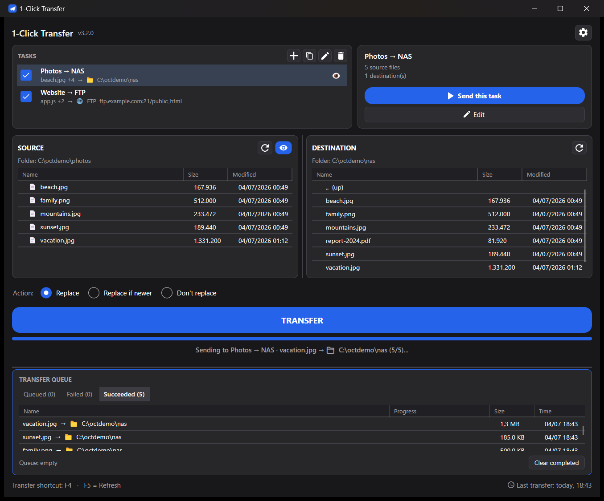
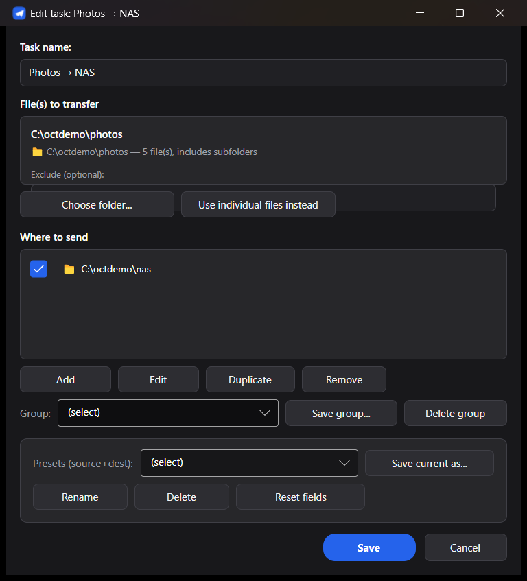
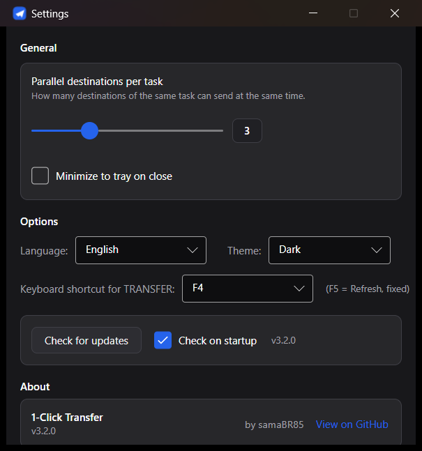

<p align="center">
  
</p>

<h1 align="center">1-Click Transfer</h1>

<p align="center">
  <a href="https://github.com/samaBR85/1clicktransfer/releases/latest"></a>
  
  
  
  
  
  
</p>

<p align="center">
  <a href="https://samabr85.github.io/1clicktransfer/"><b>🌐 Website</b></a> &nbsp;·&nbsp;
  <a href="#-english"><b>🇬🇧 English</b></a> &nbsp;·&nbsp;
  <a href="#-português"><b>🇧🇷 Português</b></a>
</p>

<hr>

<a id="-english"></a>

## 🇬🇧 English

A **cross-platform** desktop app (**C# / .NET 8, Avalonia UI**) for **Windows, Linux and macOS**.
One big **TRANSFER** button sends your pre-chosen **file(s)** to your pre-chosen **destination(s)** —
a **local/network folder**, an **FTP/FTPS** server, or **SFTP**. Set up multiple independent
**tasks** (each with its own source and destinations), send them all with one click or **one at a
time**, or let it **watch** a file and send it automatically when it changes.

<p align="center">
  
</p>

### Features
- **Multiple tasks** — each task is its own *source → destinations* pair. Toggle any on/off and
  transfer all the enabled ones with one click, or hit **Send this task** to fire just one.
- **Multiple source files** per task, sent to **multiple destinations**: local/network folders,
  **FTP/FTPS**, and **SFTP**. Destinations are a saved library with per-item checkboxes, reusable
  **named groups**, **presets**, and a library of **saved FTP/SFTP servers**.
- **Transfer queue** — a live panel shows what's queued, in progress, failed and succeeded, with
  per-item progress and a configurable **parallel destinations** limit.
- **Folder sources with exclude patterns** — pick a whole folder (recursive) as the source and
  exclude subfolders/files with simple `.gitignore`-style patterns.
- **Right-click on a destination** — create folder, rename, delete, or copy path, on local
  *and* FTP/SFTP destinations.
- **Watch (auto-send), per task** — when the source file changes, that task uploads automatically
  (great for build outputs).
- **System tray icon** — open the window, send all enabled tasks, or exit from the tray; optional
  **minimize to tray on close**.
- **Desktop notifications** on transfer completion or failure (Windows, Linux, macOS).
- **Command line** — run headless from a script, cron or Task Scheduler:
  `1clickTransfer --task "Name"`, `--all`, `--list`, `--silent`.
- **Auto-update** — checks GitHub Releases; on Windows it downloads and swaps itself, on Linux/macOS
  it shows what's new and opens the release page.
- **Action modes**: *Replace*, *Replace if newer*, *Don't replace*.
- **Navigable Source/Destination browsers** (incl. an FTP/SFTP folder browser), resizable columns
  and panels; the window **remembers its size and position**.
- **Dark / light** theme, **Portuguese / English** UI (switch in Settings).
- Passwords stored **encrypted** — Windows **DPAPI** (per user); Linux/macOS use a local AES key
  next to the settings (obfuscation, not strong security). Single **portable** executable per OS.

<p align="center">
  
  &nbsp;
  
</p>

### Download & run
Grab the latest **[Release](https://github.com/samaBR85/1clicktransfer/releases/latest)** for your OS —
each asset is a `.zip` containing a single **self-contained** executable (a `.app` bundle on macOS,
so it gets a proper Dock icon), no runtime or install needed:

| OS | Download | How to run |
|---|---|---|
| **Windows 10/11** | `1clickTransfer-win-x64.zip` | unzip, double-click `1clickTransfer.exe`. SmartScreen may warn (not code-signed): *More info → Run anyway* |
| **Linux (x64)** | `1clickTransfer-linux-x64.zip` | unzip, then `chmod +x 1clickTransfer-linux-x64 && ./1clickTransfer-linux-x64` |
| **macOS (Intel)** | `1clickTransfer-osx-x64.zip` | unzip to get `1clickTransfer.app`, then right-click → *Open* (Gatekeeper, unsigned build) |
| **macOS (Apple Silicon)** | `1clickTransfer-osx-arm64.zip` | same as Intel, arm64 build |

`settings.json` is created **next to the executable** (portable — on macOS, next to
`1clickTransfer.app/Contents/MacOS/1clickTransfer`). On Linux/macOS, if that folder
isn't writable it falls back to `~/.config/1clicktransfer/settings.json`.

### Command line
Run a transfer without opening the window — handy for scripts, cron and Task Scheduler:

| Command | What it does |
|---|---|
| `1clickTransfer --task "Name"` | send that task (repeat `--task` for several) |
| `1clickTransfer --all` | send all enabled tasks |
| `1clickTransfer --list` | list saved tasks |
| `1clickTransfer --silent` | no console output (exit code only) |
| `1clickTransfer --help` | help |

No arguments → opens the normal window. Exit codes: `0` = ok, `1` = some failure, `2` = usage error.
On macOS the binary for CLI use is `1clickTransfer.app/Contents/MacOS/1clickTransfer`.

### Run from source / build
Requires the **.NET 8 SDK**.
```bash
dotnet run --project src/OneClickTransfer.Avalonia        # run from source
dotnet test 1clickTransfer.sln -c Release                 # run the tests
# publish self-contained single-file binaries into dist-v3/ :
powershell -NoProfile -ExecutionPolicy Bypass -File tools/build-v3.ps1 -Rid all
```
`build-v3.ps1` produces `win-x64`, `linux-x64`, `osx-x64` and `osx-arm64` binaries with the
contractual names above.

> **Project layout.** `src/OneClickTransfer.Core` holds all the logic (models, services, i18n) with
> no UI; `src/OneClickTransfer.Avalonia` is the cross-platform UI (v3). `src/OneClickTransfer` is the
> frozen Windows-only WPF v2. The root `TransferApp.ps1` and the two `.vbs` files are the original
> **v1** (PowerShell/VBScript) — kept for history only and **not part of the distribution**.

### License
[MIT](LICENSE) © 2026 samaBR85.

### Credits
UI/UX and feature ideas inspired by **[Cyberduck](https://cyberduck.io)**, the open-source
file transfer browser. This project shares **no code** with Cyberduck and is independently
licensed under MIT.

<hr>

<a id="-português"></a>

## 🇧🇷 Português

Um app de desktop **multiplataforma** (**C# / .NET 8, Avalonia UI**) para **Windows, Linux e macOS**.
Um botão grande **TRANSFERIR** envia seu(s) **arquivo(s)** pré-escolhido(s) para o(s) **destino(s)**
pré-escolhido(s) — uma **pasta local/rede**, um servidor **FTP/FTPS** ou **SFTP**. Monte várias
**tarefas** independentes (cada uma com sua origem e seus destinos) e dispare todas com um clique
ou **uma de cada vez** — ou deixe o app **observar** um arquivo e enviá-lo sozinho quando ele mudar.

<p align="center">
  
</p>

### Recursos
- **Várias tarefas** — cada tarefa é um par *origem → destinos*. Ligue/desligue quais quiser e
  transfira todas as marcadas com um clique, ou use **Enviar esta tarefa** para disparar só uma.
- **Vários arquivos de origem** por tarefa, para **vários destinos**: pastas local/rede,
  **FTP/FTPS** e **SFTP**. Os destinos ficam numa biblioteca salva, com checkbox por item,
  **grupos** nomeados, **presets** reutilizáveis e uma biblioteca de **servidores FTP/SFTP salvos**.
- **Fila de transferência** — um painel ao vivo mostra o que está na fila, em andamento, com falha
  e concluído, com progresso por item e um limite configurável de **destinos em paralelo**.
- **Origem em pasta com padrões de exclusão** — escolha uma pasta inteira (recursiva) como origem e
  exclua subpastas/arquivos com padrões simples no estilo `.gitignore`.
- **Botão direito num destino** — criar pasta, renomear, excluir ou copiar o caminho, tanto local
  quanto em destinos FTP/SFTP.
- **Observar (envio automático), por tarefa** — quando o arquivo de origem muda, a tarefa envia
  sozinha (ótimo para saídas de build).
- **Ícone na bandeja do sistema** — abrir a janela, enviar todas as tarefas habilitadas ou sair
  direto da bandeja; opção de **minimizar para a bandeja ao fechar**.
- **Notificações do sistema** ao concluir ou falhar uma transferência (Windows, Linux, macOS).
- **Linha de comando** — rode sem janela por script, cron ou Agendador de Tarefas:
  `1clickTransfer --task "Nome"`, `--all`, `--list`, `--silent`.
- **Auto-update** — verifica os Releases do GitHub; no Windows baixa e se substitui, no Linux/macOS
  mostra as novidades e abre a página do release.
- **Ações**: *Substituir*, *Substituir se for mais recente*, *Não Substituir*.
- **Navegadores de Origem/Destino** (com navegador de pastas FTP/SFTP), colunas e painéis
  redimensionáveis; a janela **lembra tamanho e posição**.
- Tema **escuro / claro**, interface **Português / Inglês** (troca em Configurações).
- Senhas guardadas **criptografadas** — **DPAPI** do Windows (por usuário); no Linux/macOS uma chave
  AES local ao lado das configurações (ofuscação, não segurança forte). Um executável **portátil** por SO.

<p align="center">
  
  &nbsp;
  
</p>

### Baixar e usar
Baixe o **[Release](https://github.com/samaBR85/1clicktransfer/releases/latest)** mais recente do seu
SO — cada asset é um `.zip` com um executável **self-contained** dentro (no macOS, um `.app` com
ícone de verdade no Dock), sem runtime nem instalação:

| SO | Download | Como rodar |
|---|---|---|
| **Windows 10/11** | `1clickTransfer-win-x64.zip` | descompacte e duplo-clique em `1clickTransfer.exe`. O SmartScreen pode alertar (não é assinado): *Mais informações → Executar assim mesmo* |
| **Linux (x64)** | `1clickTransfer-linux-x64.zip` | descompacte e `chmod +x 1clickTransfer-linux-x64 && ./1clickTransfer-linux-x64` |
| **macOS (Intel)** | `1clickTransfer-osx-x64.zip` | descompacte pra obter `1clickTransfer.app`, clique com o botão direito → *Abrir* (Gatekeeper, build não assinado) |
| **macOS (Apple Silicon)** | `1clickTransfer-osx-arm64.zip` | igual ao Intel, build arm64 |

O `settings.json` é criado **ao lado do executável** (portátil — no macOS, ao lado de
`1clickTransfer.app/Contents/MacOS/1clickTransfer`). No Linux/macOS, se a pasta não for
gravável, ele usa `~/.config/1clicktransfer/settings.json`.

### Linha de comando
Dispare uma transferência sem abrir a janela — ótimo para scripts, cron e Agendador de Tarefas:

| Comando | O que faz |
|---|---|
| `1clickTransfer --task "Nome"` | envia essa tarefa (repita `--task` para várias) |
| `1clickTransfer --all` | envia todas as tarefas marcadas |
| `1clickTransfer --list` | lista as tarefas salvas |
| `1clickTransfer --silent` | sem saída no console (só o código de saída) |
| `1clickTransfer --help` | ajuda |

Sem argumentos → abre a janela normal. Códigos de saída: `0` = ok, `1` = alguma falha, `2` = erro de uso.
No macOS, o binário pra uso via CLI é `1clickTransfer.app/Contents/MacOS/1clickTransfer`.

### Rodar pelo código / compilar
Requer o **SDK do .NET 8**.
```bash
dotnet run --project src/OneClickTransfer.Avalonia        # roda pelo código-fonte
dotnet test 1clickTransfer.sln -c Release                 # roda os testes
# publica os binários single-file self-contained em dist-v3/ :
powershell -NoProfile -ExecutionPolicy Bypass -File tools/build-v3.ps1 -Rid all
```
O `build-v3.ps1` gera os binários `win-x64`, `linux-x64`, `osx-x64` e `osx-arm64` com os nomes
contratuais acima.

> **Organização.** `src/OneClickTransfer.Core` tem toda a lógica (modelos, serviços, i18n), sem UI;
> `src/OneClickTransfer.Avalonia` é a UI multiplataforma (v3). `src/OneClickTransfer` é o WPF v2
> (Windows, congelado). Os arquivos `TransferApp.ps1` e os dois `.vbs` na raiz são a versão **v1**
> original (PowerShell/VBScript) — ficam só por histórico e **não fazem parte da distribuição**.

### Licença
[MIT](LICENSE) © 2026 samaBR85.

### Créditos
UI/UX e ideias de recursos inspiradas no **[Cyberduck](https://cyberduck.io)**, o navegador
de transferência de arquivos open source. Este projeto **não compartilha código** com o
Cyberduck e é licenciado de forma independente sob MIT.
