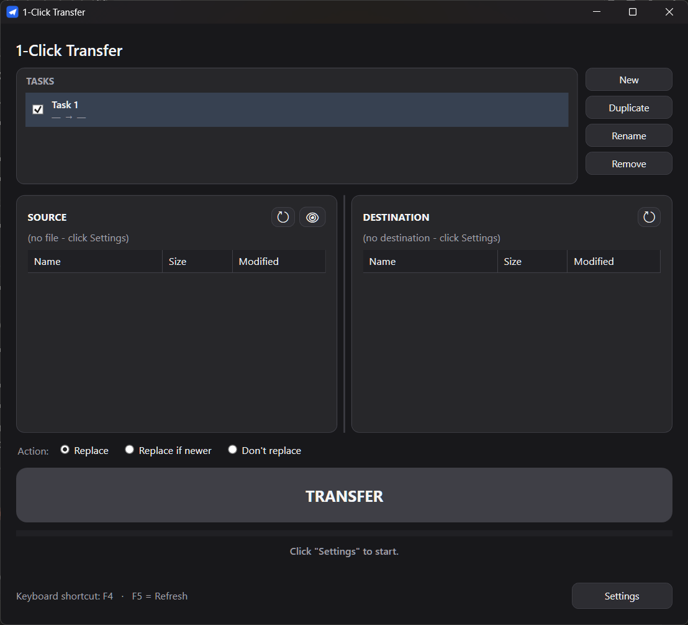
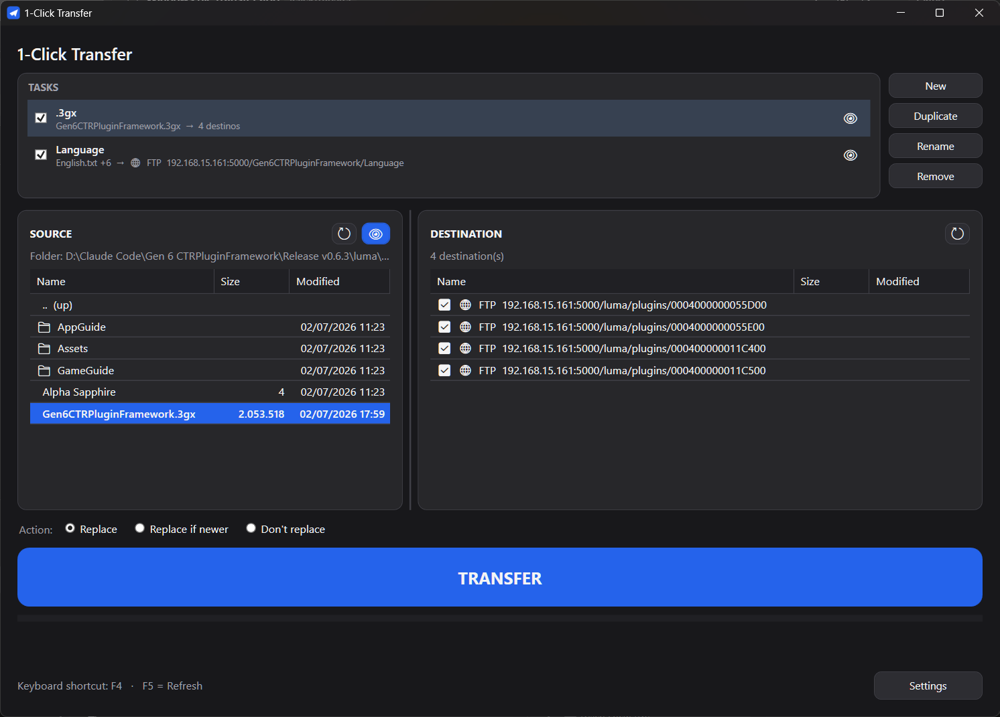
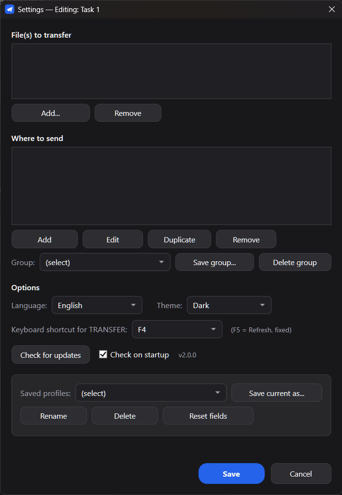
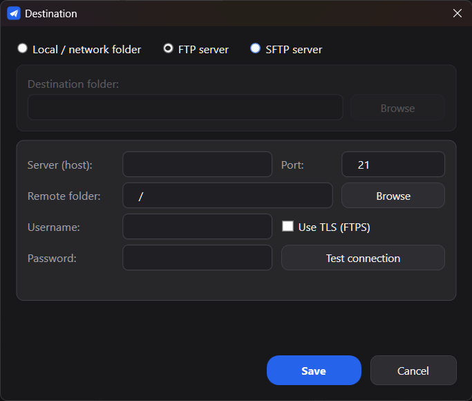

<p align="center">
  
</p>

<h1 align="center">1-Click Transfer</h1>

<p align="center">
  <a href="https://github.com/samaBR85/1clicktransfer/releases/latest"></a>
  
  
  
  
  
</p>

<p align="center">
  <a href="https://samabr85.github.io/1clicktransfer/"><b>🌐 Website</b></a> &nbsp;·&nbsp;
  <a href="#-english"><b>🇬🇧 English</b></a> &nbsp;·&nbsp;
  <a href="#-português"><b>🇧🇷 Português</b></a>
</p>

<hr>

<a id="-english"></a>

## 🇬🇧 English

A native Windows app (**C# / .NET 8, WPF**). One big **TRANSFER** button sends your pre-chosen
**file(s)** to your pre-chosen **destination(s)** — a **local/network folder**, an **FTP/FTPS**
server, or **SFTP**. Set up multiple independent **tasks** (each with its own source and
destinations) and fire them all with a single click — or let it **watch** a file and send it
automatically when it changes.

<p align="center">
  
</p>

### Features
- **Multiple tasks** — each task is its own *source → destinations* pair. Toggle any on/off and
  transfer all the enabled ones with one click.
- **Multiple source files** per task, sent to **multiple destinations**: local/network folders,
  **FTP/FTPS**, and **SFTP**. Destinations are a saved library with per-item checkboxes and
  reusable **named groups**.
- **Watch (auto-send), per task** — when the source file changes, that task uploads automatically.
- **Command line** — run headless from a script or Windows Task Scheduler:
  `1clickTransfer --task "Name"`, `--all`, `--list`, `--silent`.
- **Auto-update** — checks GitHub for new releases and updates itself.
- **Action modes**: *Replace*, *Replace if newer*, *Don't replace*.
- **Navigable Source/Destination panels** (incl. an FTP/SFTP folder browser), resizable columns
  and tasks panel; the window **remembers its size and position**.
- **Dark / light** theme, **Portuguese / English** UI (switch in Settings).
- Passwords stored **encrypted** (Windows DPAPI, per user). Single **portable** `.exe`.

<p align="center">
  
</p>

<p align="center">
  
  &nbsp;
  
</p>

### Download & run
1. Grab the latest **[Release](https://github.com/samaBR85/1clicktransfer/releases/latest)** and
   download **`1clickTransfer.exe`**.
2. Run it. No installation needed — it's a single portable executable.
3. First launch may trigger Windows **SmartScreen** (the app isn't code-signed): click
   *More info → Run anyway*. It's safe — the full source is here.

`settings.json` is created **next to the .exe** (portable).

### Command line
Run a transfer without opening the window — handy for scripts and Task Scheduler:

| Command | What it does |
|---|---|
| `1clickTransfer --task "Name"` | send that task (repeat `--task` for several) |
| `1clickTransfer --all` | send all enabled tasks |
| `1clickTransfer --list` | list saved tasks |
| `1clickTransfer --silent` | no console output (exit code only) |
| `1clickTransfer --help` | help |

No arguments → opens the normal window. Exit codes: `0` = ok, `1` = some failure, `2` = usage error.

### Auto-update
The app checks GitHub Releases on startup (toggle in Settings, or **Check for updates**), shows
what's new, downloads the new version, and restarts itself.

### Run from source / build
Requires the **.NET 8 SDK**.
```powershell
dotnet run --project src\OneClickTransfer          # run from source
powershell -NoProfile -ExecutionPolicy Bypass -File tools\build-v2.ps1   # -> dist-v2\1clickTransfer.exe
```
`build-v2.ps1` publishes a single-file, self-contained `win-x64` executable.

> **Legacy (v1).** The root `TransferApp.ps1`, `Iniciar.vbs` and `Criar atalho na Area de Trabalho.vbs`
> are the original v1 (PowerShell/VBScript). They are kept for history only and are **not part of the
> v2/v3 distribution** — don't run or ship them. The current app is the C# build above.

### License
[MIT](LICENSE) © 2026 samaBR85.

### Credits
UI/UX and feature ideas inspired by **[Cyberduck](https://cyberduck.io)**, the open-source
file transfer browser. This project shares **no code** with Cyberduck and is independently
licensed under MIT.

<hr>

<a id="-português"></a>

## 🇧🇷 Português

Um app nativo para Windows (**C# / .NET 8, WPF**). Um botão grande **TRANSFERIR** envia seu(s)
**arquivo(s)** pré-escolhido(s) para o(s) **destino(s)** pré-escolhido(s) — uma **pasta local/rede**,
um servidor **FTP/FTPS** ou **SFTP**. Monte várias **tarefas** independentes (cada uma com sua
origem e seus destinos) e dispare todas com um clique — ou deixe o app **observar** um arquivo e
enviá-lo automaticamente quando ele mudar.

<p align="center">
  
</p>

### Recursos
- **Várias tarefas** — cada tarefa é um par *origem → destinos*. Ligue/desligue quais quiser e
  transfira todas as marcadas com um clique.
- **Vários arquivos de origem** por tarefa, para **vários destinos**: pastas local/rede,
  **FTP/FTPS** e **SFTP**. Os destinos ficam numa biblioteca salva, com checkbox por item e
  **grupos** nomeados reutilizáveis.
- **Observar (envio automático), por tarefa** — quando o arquivo de origem muda, a tarefa envia sozinha.
- **Linha de comando** — rode sem janela por script ou Agendador de Tarefas:
  `1clickTransfer --task "Nome"`, `--all`, `--list`, `--silent`.
- **Auto-update** — verifica novas versões no GitHub e se atualiza sozinho.
- **Ações**: *Substituir*, *Substituir se for mais recente*, *Não Substituir*.
- **Painéis de Origem/Destino naveg&aacute;veis** (com navegador de pastas FTP/SFTP), colunas e painel
  de tarefas redimension&aacute;veis; a janela **lembra tamanho e posição**.
- Tema **escuro / claro**, interface **Português / Inglês** (troca no Configurar).
- Senhas guardadas **criptografadas** (DPAPI do Windows, por usuário). Um `.exe` **portátil**.

<p align="center">
  
</p>

<p align="center">
  
  &nbsp;
  
</p>

### Baixar e usar
1. Baixe o **[Release](https://github.com/samaBR85/1clicktransfer/releases/latest)** mais recente e
   pegue o **`1clickTransfer.exe`**.
2. Execute. Não precisa instalar — é um único executável portátil.
3. Na primeira execução o **SmartScreen** pode alertar (o app não é assinado): clique em
   *Mais informações → Executar assim mesmo*. É seguro — o código está todo aqui.

O `settings.json` é criado **ao lado do .exe** (portátil).

### Linha de comando
Dispare uma transferência sem abrir a janela — ótimo para scripts e Agendador de Tarefas:

| Comando | O que faz |
|---|---|
| `1clickTransfer --task "Nome"` | envia essa tarefa (repita `--task` para várias) |
| `1clickTransfer --all` | envia todas as tarefas marcadas |
| `1clickTransfer --list` | lista as tarefas salvas |
| `1clickTransfer --silent` | sem saída no console (só o código de saída) |
| `1clickTransfer --help` | ajuda |

Sem argumentos → abre a janela normal. Códigos de saída: `0` = ok, `1` = alguma falha, `2` = erro de uso.

### Auto-update
O app verifica os Releases do GitHub ao iniciar (ligável no Configurar, ou botão **Procurar
atualizações**), mostra as novidades, baixa a nova versão e reinicia sozinho.

### Rodar pelo código / compilar
Requer o **SDK do .NET 8**.
```powershell
dotnet run --project src\OneClickTransfer          # roda pelo código-fonte
powershell -NoProfile -ExecutionPolicy Bypass -File tools\build-v2.ps1   # -> dist-v2\1clickTransfer.exe
```
O `build-v2.ps1` publica um executável único, self-contained, para `win-x64`.

> **Legado (v1).** Os arquivos `TransferApp.ps1`, `Iniciar.vbs` e `Criar atalho na Area de Trabalho.vbs`
> na raiz são a versão v1 original (PowerShell/VBScript). Ficam só por histórico e **não fazem parte da
> distribuição v2/v3** — não execute nem distribua. O app atual é o build C# acima.

### Licença
[MIT](LICENSE) © 2026 samaBR85.

### Créditos
UI/UX e ideias de recursos inspiradas no **[Cyberduck](https://cyberduck.io)**, o navegador
de transferência de arquivos open source. Este projeto **não compartilha código** com o
Cyberduck e é licenciado de forma independente sob MIT.
